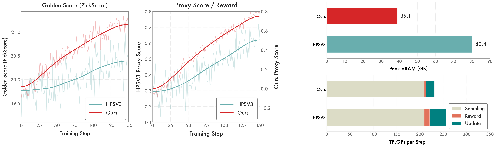

<div align="center">

# Beyond VLM-Based Rewards: Diffusion-Native Latent Reward Modeling

</div>

<div align="center" style="font-family: charter;">
    <a href="#">Gongye Liu</a>,
    <a href="#">Bo Yang</a>,
    <a href="#">Yida Zhi</a>,
    <a href="#">Zhizhou Zhong</a>,
    <a href="#">Lei Ke</a>,
    <a href="#">Didan Deng</a>,
    <a href="#">Han Gao</a>,
    <a href="#">Yongxiang Huang</a>,
    <a href="#">Kaihao Zhang</a>,
    <a href="#">Hongbo Fu</a>,
    <a href="#">Wenhan Luo</a>
    <br>
    <sup>1</sup>HKUST &nbsp;&nbsp;&nbsp;&nbsp;
    <sup>2</sup>Huawei Hong Kong AI Framework 

</div>

> *a diffusion-native latent reward model, competitive reward accuracy, much cheaper for alignment*

## 🧧 Happy Chinese New Year! 

We are actively preparing the repository for public release. The full codebase and pre-trained models will be open-sourced in a few weeks. Stay tuned! 🚀


🗺️ Open-source Roadmap：


- [x] Training and Inference source code, and pre-trained checkpoints for SD3.5-Medium.
- [ ] Release of the preprocessed training dataset and training guidance.
- [ ] Evaluation code & logistic normalization.
- [ ] Training code for alignment stage.
- [ ] Support for additional backbones (e.g., Flux, Z-image-turbo).


## ⚙️ Installation

To set up the environment, we recommend using Conda to manage dependencies. Follow these steps to get started:

```Bash
# 1. Create a new conda environment
conda create -n diffusion-rm python=3.10 -y
conda activate diffusion-rm

# 2. Install the package in editable mode
# This will install all necessary dependencies including torch and diffusers
pip install -e .
```
--
## 🚀 Inference & Testing

We provide two primary methods to evaluate images using DiNa-LRM. You can either score images generated on-the-fly or score existing image files from your local disk.

<details>

<summary>
1. Reward from Pipeline-Generated Latents 
</summary>

In this scenario, the model scores the "clean" latent directly produced by the diffusion transformer before the final VAE decoding.

```Python
import torch
from diffusers import StableDiffusion3Pipeline
from diffusion_rm.models.sd3_rm import encode_prompt
from diffusion_rm.infer.inference import DRMInferencer

# Load SD3.5 Pipeline
device = torch.device('cuda:0')
dtype = torch.bfloat16
pipe = StableDiffusion3Pipeline.from_pretrained(
    "stabilityai/stable-diffusion-3.5-medium", 
    torch_dtype=dtype
).to(device)
pipe.vae.to(device, dtype=dtype)
pipe.text_encoder.to(device, dtype=dtype)
pipe.text_encoder_2.to(device, dtype=dtype)
pipe.text_encoder_3.to(device, dtype=dtype)
pipe.transformer.to(device, dtype=dtype)

text_encoders = [pipe.text_encoder, pipe.text_encoder_2, pipe.text_encoder_3]
tokenizers = [pipe.tokenizer, pipe.tokenizer_2, pipe.tokenizer_3]
def compute_text_embeddings(text_encoders, tokenizers, prompts):
    with torch.no_grad():
        prompt_embeds, pooled_prompt_embeds = encode_prompt(
            text_encoders, tokenizers, prompts, max_sequence_length=256
        )
        prompt_embeds = prompt_embeds.to(text_encoders[0].device)
        pooled_prompt_embeds = pooled_prompt_embeds.to(text_encoders[0].device)

    return prompt_embeds, pooled_prompt_embeds

# Initialize DiNa-LRM Scorer
scorer = DRMInferencer(
    pipeline=pipe,
    config_path=None,
    model_path="liuhuohuo/DiNa-LRM-SD35M-12layers",
    device=device,
    model_dtype=dtype,
    load_from_disk=False,
)

# 1. Generate latents (Set output_type='latent' for DiNa-LRM)
prompt = "A girl walking in the street"

with torch.no_grad():
    # Helper to get embeddings
    prompt_embeds, pooled_embeds = compute_text_embedding(text_encoders, tokenizers, [prompt], )
s
    output = pipe(prompt_embeds=prompt_embeds, pooled_prompt_embeds=pooled_prompt_embeds, num_inference_steps=40, guidance_scale=4.5, output_type='latent')
    latents = output.images
    

# 2. compute reward
with torch.no_grad():
    raw_score = scorer.reward(
        text_conds={'encoder_hidden_states': prompt_embeds.to(device), 'pooled_projections': pooled_embeds.to(device)},
        latents=latents,
        u=0.4
    )
    score = (raw_score + 10.0) / 10.0
    print(f"DiNa-LRM Score: {score.item()}")

# 3. [Optional] decode and save images
with torch.no_grad():
    latents_decoded = (latents / pipe.vae.config.scaling_factor) + pipe.vae.config.shift_factor
    image = pipe.vae.decode(latents_decoded.to(pipe.vae.dtype), return_dict=False)[0]
    image = pipe.image_processor.postprocess(image, output_type="pil")[0]
    
image.save("example.png")
```


</details>


<details>

<summary>
2. Reward from Local Image Files
</summary>

To score existing images, we first encode the image into the latent space using the VAE encoder.

```Python
import torch
from diffusers import StableDiffusion3Pipeline
from diffusion_rm.models.sd3_rm import encode_prompt
from diffusion_rm.infer.inference import DRMInferencer

# Load SD3.5 Pipeline
device = torch.device('cuda:0')
dtype = torch.bfloat16
pipe = StableDiffusion3Pipeline.from_pretrained(
    "stabilityai/stable-diffusion-3.5-medium", 
    torch_dtype=dtype
).to(device)
pipe.vae.to(device, dtype=dtype)
pipe.text_encoder.to(device, dtype=dtype)
pipe.text_encoder_2.to(device, dtype=dtype)
pipe.text_encoder_3.to(device, dtype=dtype)
pipe.transformer.to(device, dtype=dtype)

text_encoders = [pipe.text_encoder, pipe.text_encoder_2, pipe.text_encoder_3]
tokenizers = [pipe.tokenizer, pipe.tokenizer_2, pipe.tokenizer_3]
def compute_text_embeddings(text_encoders, tokenizers, prompts):
    with torch.no_grad():
        prompt_embeds, pooled_prompt_embeds = encode_prompt(
            text_encoders, tokenizers, prompts, max_sequence_length=256
        )
        prompt_embeds = prompt_embeds.to(text_encoders[0].device)
        pooled_prompt_embeds = pooled_prompt_embeds.to(text_encoders[0].device)

    return prompt_embeds, pooled_prompt_embeds


# Initialize DiNa-LRM Scorer
scorer = DRMInferencer(
    pipeline=pipe,
    config_path=None,
    model_path="liuhuohuo/DiNa-LRM-SD35M-12layers",
    device=device,
    model_dtype=dtype,
    load_from_disk=False,
)

# 1. Load and Preprocess Image
image_path = "assets/example.png"
raw_image = Image.open(image_path).convert("RGB")
transform = T.Compose([T.ToTensor(), T.Normalize([0.5], [0.5])])
image_tensor = transform(raw_image).unsqueeze(0).to(device, dtype=dtype)

prompt = "A girl walking in the street"

with torch.no_grad():
    # Helper to get embeddings
    prompt_embeds, pooled_embeds = compute_text_embedding(text_encoders, tokenizers, [prompt], )


# 2. Encode to Latent Space
with torch.no_grad():
    latents = pipe.vae.encode(image_tensor).latent_dist.sample()
    latents = (latents - pipe.vae.config.shift_factor) * pipe.vae.config.scaling_factor

# 3. Compute Reward
# Note: score normalization is often calculated as: $$score = \frac{raw\_score + 10.0}{10.0}$$
raw_score = scorer.reward(
    text_conds={'encoder_hidden_states': prompt_embeds, 'pooled_projections': pooled_embeds},
    latents=latents,
    u=0.1 # Lower u is recommended for static/clean images
)
score = (raw_score + 10.0) / 10.0
print(f"Local Image Score: {score.item()}")
```


</details>


## 🛠️ Training

preparing....


### Method

<div align="center">
    
</div>

---

### Alignment Performance

<div align="center">
    
</div>

---

---
